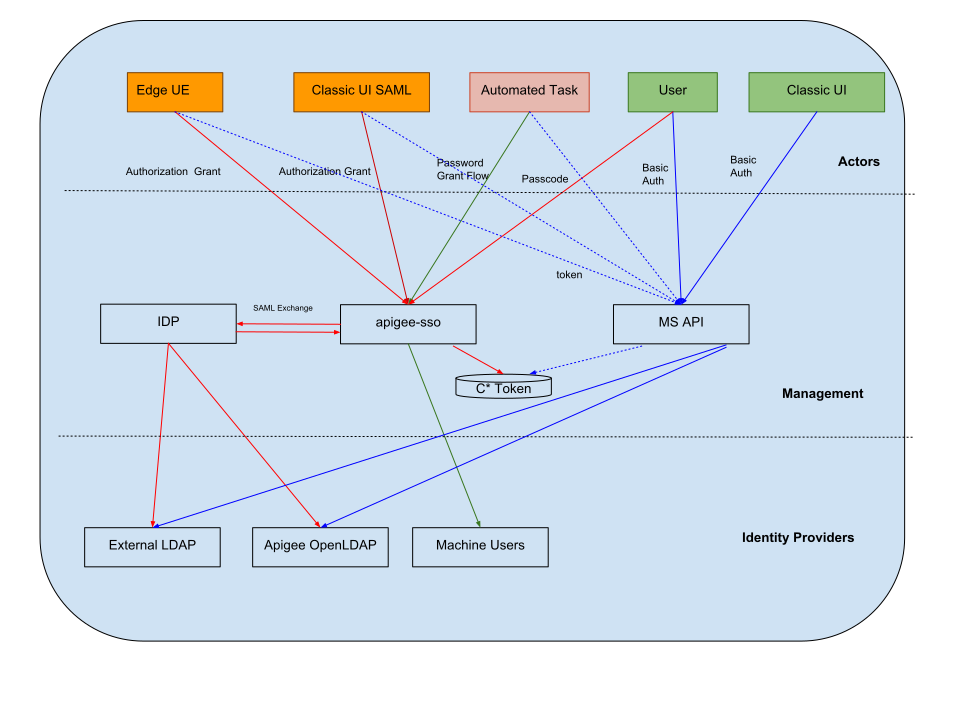

# Apigee Internal IDP

## Overview

This project installs an saml sso based internal idp as apigee service so that you can configure apigee with an idp for SAML flows.
Apigee UE(Unified Experience) comes with only SAML only support which means you need an idp to get started.

Further the local idp can either connect to openldap that comes with Apigee Installation or to your configure with your own ldap directorty service. 

# Architecture 


## Getting Started

### Prerequisites

- Setup apigee-service

apigee-internal idp is an apigee service and follows the same installation pattern as any other apigee components. Please look at the Apigee Private Cloud documentation on installing apigee-service. 

- Setup repo

On the machine where you install apigee-internal-idp, create /etc/yum.repos.d/apigee-idp.repo with following contents:

```
[apigee-internal-idp]
name = Apigee  Custom Repo
baseurl = https://raw.githubusercontent.com/rajeshm7910/apigee-internal-idp/master/dist/1.0.0
enabled = 1
gpgcheck = 0
```

### Setup

- Create Key/Cert pair for setting up IDP.
  
 Generate a TLS cert and key and store them in a keystore fil alsoe. You can use a self-signed certificate CA certs.
 To create a keystore file from your cert and key:

1. Create a directory for the JKS file:
```
sudo mkdir -p /opt/apigee/customer/application/apigee-internal-idp/tomcat-ssl/
```
2. Change to the new directory:
```
cd /opt/apigee/customer/application/apigee-internal-idp/tomcat-ssl/
```

3. Create a JKS file containing the cert and key. You must specify a keystore for this mode that contains a cert signed by a CA.For an example of creating a JKS file, see Configuring TLS/SSL for Edge On Premises.

4. Make the JKS file owned by the "apigee" user:
```
sudo chown -R apigee:apigee /opt/apigee/customer/application/apigee-internal-idp/tomcat-ssl
```
5. In case you want to quickly create a self signed Cert in JKS
```
mkdir -p /opt/apigee/customer/application/apigee-internal-idp/tomcat-ssl
cd /opt/apigee/customer/application/apigee-internal-idp/tomcat-ssl
sudo openssl genrsa -aes256 -passout pass:Secret123 -out key.pem 2048
sudo openssl rsa -in key.pem -passin pass:Secret123  -out key.pem

sudo openssl req -x509 -sha256 -new -key key.pem -out cert.csr  -subj "/C=US/ST=Foo/L=Bar/O=Foobar/OU=Sales/CN=Foobar.com/emailAddress=foo@bar.com" -passin pass:Secret123
sudo openssl x509 -sha256 -days 365 -in cert.csr -signkey key.pem -out cert.pem -passin pass:Secret123

sudo openssl pkcs12 -export -in cert.pem -inkey key.pem -out cert.p12 -passout pass:Secret123

sudo keytool -importkeystore -srckeystore cert.p12 -srcstoretype PKCS12 -destkeystore cert.jks -deststoretype JKS -deststorepass Secret123 -srcstorepass Secret123

sudo keytool -changealias -alias "1" -destalias "idp" -keystore cert.jks -storepass Secret123
sudo chown -R apigee:apigee /opt/apigee/customer/application/apigee-internal-idp/tomcat-ssl

```
- Create a silent config file as shown in example below
```
#Public hostname of IDP hostname
APIGEE_PASSWORD=Secret123
MANAGEMENT_UI_PUBLIC_IP=public_hostname_or_ip_of_Edge_Management_UI
IDP_HOSTNAME=public_hostname_or_ip_of_IDP
#This parameter specifies where password reset mails will be sent.Set this to http://{EDGE_UI}:9000 in case you wanto to use classic UI
EDGE_UE_URL=http://${MANAGEMENT_UI_PUBLIC_IP}:3001


#Points to LDAP Host that gets installed with Apigee. In case of external ldap it should point to external ldap. In case its aio setup its localhost
LDAP_HOSTNAME=localhost #hostname_or_ip_of_ldap
LDAP_PORT=10389 #ldap port

# Specify the port, typically between 1025 and 65535.
IDP_TOMCAT_PORT=9090
IDP_TOMCAT_SCHEME=https
IDP_TOMCAT_ENABLE_SSL=true
# Specify the path to the keystore file.
IDP_TOMCAT_KEYSTORE_FILEPATH=/opt/apigee/customer/application/apigee-internal-idp/tomcat-ssl/cert.jks
IDP_TOMCAT_KEYSTORE_ALIAS=idp
# The password specified when you created the keystore.
IDP_TOMCAT_KEYSTORE_PASSWORD=Secret123

#This are shibboleth Settings
IDP_SEALER_PASSWORD=Secret123
IDP_KEYSTORE_PASSWORD=Secret123
IDP_SEALER_KEYPASSWORD=Secret123
IDP_SEALER_STOREPASSWORD=Secret123

```
- Install apigee-internal-idp
```
/opt/apigee/apigee-service/bin/apigee-service  apigee-internal-idp install
/opt/apigee/apigee-service/bin/apigee-service apigee-internal-idp setup -f /tmp/idp-config.txt
```
- Get the IDP Metadata
```
curl -k https://hostname:9090/idp/metadata
```
- Setup apigee-sso with the idp metadata. 
Follow instructions https://docs.apigee.com/private-cloud/v4.18.05/supporting-saml-edge-private-cloud

- Setup edge-ue as documented in apigee documentation
- Fix edge-management-ue routes to support password Flows
UE doesn't support Forgot Password feature. To enable this feature, run this command on the box where edge-management-ui is installed
```
curl https://raw.githubusercontent.com/rajeshm7910/apigee-internal-idp/master/dist/1.0.0/fix-ue-routes.sh | sh -
```

### How to Test?
- In case you are using classic UI, go to http://edge-ui-host:9000. For UE, go to http://edge-management-ui-host:3001
- You will be prompted with Sign in With your Account Page.
- On Clicking Sign In, you will be presented with Login Page.
- Sign in with your opdk credentials. You should be in
- Go to Admin->Users and Create a user (email) and associate with a role.
- The user should be  get an email and he should be able to click on Password reset to set his account password.
- Use Management API calls with the same credentials. You can use both basic and token based authentication for your users.

### How to install Classic ui and UE on same machine?

Classic UI and UE can't be run on same box because they use  common component edge-ui with different configurations. Edge UE(edge-management-ui) depends on edge-ui(Shoehorn or Classic edge ui). It can only be possible to run them in same box if we can clone edge-ui and run the cloned version on a different port.

- Install
Assuming you have Classic UI(edge-ui) component already installed, you can run following script to clone edge-ui as edge-classic-ui.
```
curl https://raw.githubusercontent.com/rajeshm7910/apigee-internal-idp/master/dist/1.0.0/clone-edge-ui.sh | sh -
```
This script creates a apigee-service named edge-classic-ui. This will also set the port as 9098. In case you want to set at other port run this command
- Change Port
```
curl https://raw.githubusercontent.com/rajeshm7910/apigee-internal-idp/master/dist/1.0.0/clone-edge-ui.sh | sh -s <your-port>
```

- Setup 
You can now setup edge-classic-ui and configure sso. Follow instructions in https://docs.apigee.com/private-cloud/v4.18.05/installing-beta-release-edge-new-unified-experience to setup shoehorn UI.
```
Configure the Edge UI:
/opt/apigee/apigee-service/bin/apigee-service edge-classic-ui setup -f configFile

Enable SAML on the Edge UI:
/opt/apigee/apigee-service/bin/apigee-service edge-classic-ui configure-sso -f configFile
```

- Uninstall edge-classic-ui
```
rm -fr /opt/apigee/edge-classic-ui*
```

### Uninstall apigee-internal-idp

```
yum autoremove apigee-internal-idp
rm -fr /opt/apigee/apigee-internal-idp*
```


